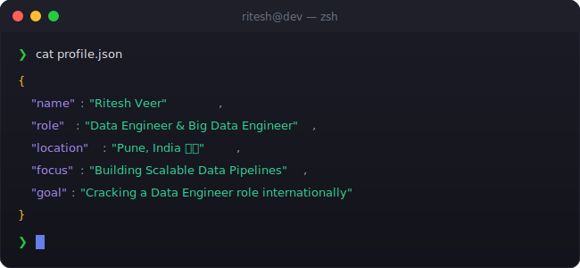

<!-- 
╔══════════════════════════════════════════════════════════════════════════════╗
║                                                                              ║
║   ██████╗ ███████╗██████╗  ██████╗ ██╗   ██╗ █████╗ ███╗   ██╗██╗   ██╗██╗   ║
║   ██╔══██╗██╔════╝██╔══██╗██╔═══██╗╚██╗ ██╔╝██╔══██╗████╗  ██║██║   ██║██║   ║
║   ██████╔╝█████╗  ██║  ██║██║   ██║ ╚████╔╝ ███████║██╔██╗ ██║██║   ██║██║   ║
║   ██╔══██╗██╔══╝  ██║  ██║██║   ██║  ╚██╔╝  ██╔══██║██║╚██╗██║██║   ██║██║   ║
║   ██║  ██║███████╗██████╔╝╚██████╔╝   ██║   ██║  ██║██║ ╚████║╚██████╔╝███████╗
║   ╚═╝  ╚═╝╚══════╝╚═════╝  ╚═════╝    ╚═╝   ╚═╝  ╚═╝╚═╝  ╚═══╝ ╚═════╝ ╚══════╝
║                                                                              ║
║              🚀 AI DEVELOPER • PYTHON ENGINEER • PROBLEM SOLVER 🚀           ║
║                                                                              ║
╚══════════════════════════════════════════════════════════════════════════════╝
-->

<div align="center">
  
  <!-- ═══════════════════════════════════════════════════════════════════════════ -->
  <!-- 🎯 ANIMATED HEADER                                                          -->
  <!-- ═══════════════════════════════════════════════════════════════════════════ -->
  
  
  
  <br/>
  
  <!-- ═══════════════════════════════════════════════════════════════════════════ -->
  <!-- 📊 PROFILE BADGES                                                           -->
  <!-- ═══════════════════════════════════════════════════════════════════════════ -->
  
  <a href="https://github.com/riteshveer">
    
  </a>
  &nbsp;
  <a href="https://github.com/riteshveer?tab=repositories">
    
  </a>
  &nbsp;
  <a href="https://github.com/riteshveer?tab=followers">
    
  </a>
  &nbsp;
  <a href="https://github.com/riteshveer">
    
  </a>
  
</div>

<br/>

<!-- ═══════════════════════════════════════════════════════════════════════════ -->
<!-- 🖥️ TERMINAL INTRO SECTION                                                   -->
<!-- ═══════════════════════════════════════════════════════════════════════════ -->

<div align="center">
  
</div>

<br/>


<br/>

<!-- ═══════════════════════════════════════════════════════════════════════════ -->
<!-- 👤 ABOUT ME SECTION                                                          -->
<!-- ═══════════════════════════════════════════════════════════════════════════ -->


<br/><br/>

<table>
<tr>
<td width="55%" valign="top">

### 🎯 What I Do

```yaml
name: Ritesh Veer
located_in: Pune, India 🇮🇳
current_status: B.Tech CSE (AI/ML) Student — Graduating 2027

areas_of_expertise:
  - 🔧 Data Engineering & ETL Pipelines
  - 📊 Big Data (Spark, Hadoop, Hive, Kafka)
  - 🤖 Machine Learning & EDA
  - ☁️  Cloud Platforms (Azure, GCP)
  - 🗄️  Databases & SQL

currently_building:
  - End-to-end data pipeline projects
  - Big Data portfolio for international roles
  - Machine Learning models

life_philosophy: "Data is the new oil. Pipelines are the refineries."
```

</td>
<td width="45%" valign="top">

### 🚀 Current Focus

- 🔬 **Building** production-grade ETL & data pipelines
- 📦 **Learning** PySpark, Airflow, and Databricks deeply
- ☁️  **Exploring** cloud-native data engineering on Azure & GCP
- 📚 **Studying** Big Data Analytics and distributed systems

<br/>

### 💡 Quick Facts

- 🎓 B.Tech CSE with AI/ML specialisation at PCU, Pune
- 🔥 Passionate about scalable data systems
- 🌱 Currently going deep on Big Data & cloud pipelines

   
</td>
</tr>
</table>

<br/>


<br/>

<!-- ═══════════════════════════════════════════════════════════════════════════ -->
<!-- 🎮 CONTRIBUTION SHOWCASE                                                    -->
<!-- ═══════════════════════════════════════════════════════════════════════════ -->


<br/><br/>

<div align="center">
  
  <!-- Pac-Man Contribution Graph -->
  <picture>
    <source media="(prefers-color-scheme: dark)" srcset="./assets/pacman-contribution-graph-dark.svg"/>
    <source media="(prefers-color-scheme: light)" srcset="./assets/pacman-contribution-graph.svg"/>
    
  </picture>
  
  <br/>
  
  <sub>👾 Watch Pac-Man devour my contributions!</sub>
  
</div>

<br/>


<br/>

<!-- ═══════════════════════════════════════════════════════════════════════════ -->
<!-- ⚡ TECH STACK                                                               -->
<!-- ═══════════════════════════════════════════════════════════════════════════ -->


<br/><br/>

<div align="center">

<!-- 💻 LANGUAGES -->
<h4>💻 Languages</h4>
<p>
  <a href="https://www.python.org/" target="_blank"></a>
  <a href="https://www.mysql.com/" target="_blank"></a>
  <a href="https://www.java.com/" target="_blank"></a>
</p>

<!-- 🔁 BIG DATA & DATA ENGINEERING -->
<h4>🔁 Big Data & Data Engineering</h4>
<p>

Apache Spark:
<a href="https://spark.apache.org/" target="_blank"></a>

Hadoop:
<a href="https://hadoop.apache.org/" target="_blank"></a>

Hive:
<a href="https://hive.apache.org/" target="_blank"></a>

Kafka:
<a href="https://kafka.apache.org/" target="_blank"></a>

Airflow:
<a href="https://airflow.apache.org/" target="_blank"></a>

Databricks:


Anaconda:
<a href="https://www.anaconda.com/" target="_blank"></a>

GCP:
<a href="https://cloud.google.com/" target="_blank"></a>

</p>

<!-- 🤖 AI & MACHINE LEARNING -->
<h4>🤖 AI & Machine Learning</h4>
<p>
  <a href="https://scikit-learn.org/" target="_blank"></a>
  <a href="https://pandas.pydata.org/" target="_blank"></a>
  <a href="https://numpy.org/" target="_blank"></a>
  <a href="https://matplotlib.org/" target="_blank"></a>
  <a href="https://seaborn.pydata.org/" target="_blank"></a>
</p>

<!-- 🗄️ DATABASES -->
<h4>🗄️ Databases</h4>
<p>
  <a href="https://www.mysql.com/" target="_blank"></a>
</p>

<!-- 🔧 TOOLS & PLATFORMS -->
<h4>🔧 Tools & Platforms</h4>
<p>
  <a href="https://git-scm.com/" target="_blank"></a>
  <a href="https://www.docker.com/" target="_blank"></a>
  <a href="https://www.linux.org/" target="_blank"></a>
  <a href="https://code.visualstudio.com/" target="_blank"></a>
  <a href="https://azure.microsoft.com/" target="_blank"></a>
  <a href="https://jupyter.org/" target="_blank"></a>
  <a href="https://www.jetbrains.com/idea/" target="_blank"></a>
  <a href="https://www.tableau.com/" target="_blank"></a>
  <a href="https://www.microsoft.com/en-us/microsoft-365/excel" target="_blank"></a>
</p>

</div>

<br/>


<br/>

<!-- ═══════════════════════════════════════════════════════════════════════════ -->
<!-- 🔥 CURRENTLY WORKING ON                                                     -->
<!-- ═══════════════════════════════════════════════════════════════════════════ -->

<div align="center">
  
### ⚡ Currently Building & Learning

<br/>

<a href="https://github.com/riteshveer">
  
</a>
&nbsp;
<a href="https://github.com/riteshveer">
  
</a>
&nbsp;
<a href="https://github.com/riteshveer">
  
</a>

</div>

<br/>


<br/>

<!-- ═══════════════════════════════════════════════════════════════════════════ -->
<!-- 🌐 CONNECT WITH ME                                                          -->
<!-- ═══════════════════════════════════════════════════════════════════════════ -->


<br/><br/>

<div align="center">
  
<a href="https://github.com/riteshveer" target="_blank">
  
</a>
&nbsp;
<a href="https://linkedin.com/in/riteshveer" target="_blank">
  
</a>
&nbsp;
<a href="https://fb.com/redoyanulhaque.hacker.official" target="_blank">
  
</a>
&nbsp;
<a href="https://instagram.com/red_1_ul" target="_blank">
  
</a>
&nbsp;
<a href="https://www.hackerrank.com/redoyanulhaques1" target="_blank">
  
</a>
&nbsp;
<a href="mailto:redoyanul1234@gmail.com">
  
</a>

</div>

<br/>


<br/>

<!-- ═══════════════════════════════════════════════════════════════════════════ -->
<!-- 💡 RANDOM DEV QUOTE                                                         -->
<!-- ═══════════════════════════════════════════════════════════════════════════ -->

<div align="center">
  
### 💭 Random Dev Quote

<br/>

<a href="https://github.com/riteshveer">
  
</a>

</div>

<br/>

<!-- ═══════════════════════════════════════════════════════════════════════════ -->
<!-- 🌟 FOOTER                                                                   -->
<!-- ═══════════════════════════════════════════════════════════════════════════ -->

<div align="center">
  
  
  
  <br/><br/>
  
  
  
</div>

<!-- ═══════════════════════════════════════════════════════════════════════════ -->
<!-- 📝 END OF README                                                            -->
<!-- ═══════════════════════════════════════════════════════════════════════════ -->
